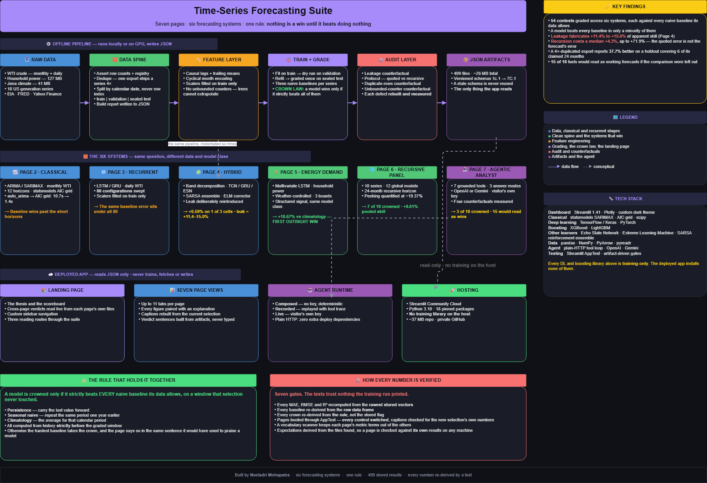
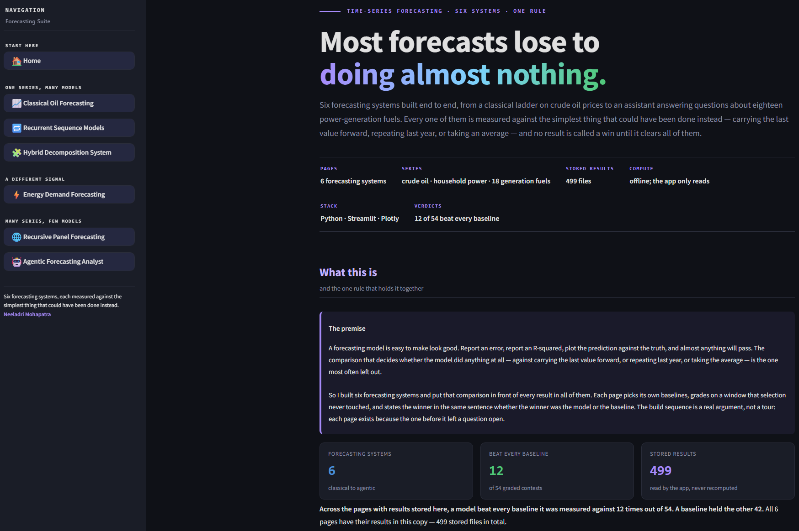
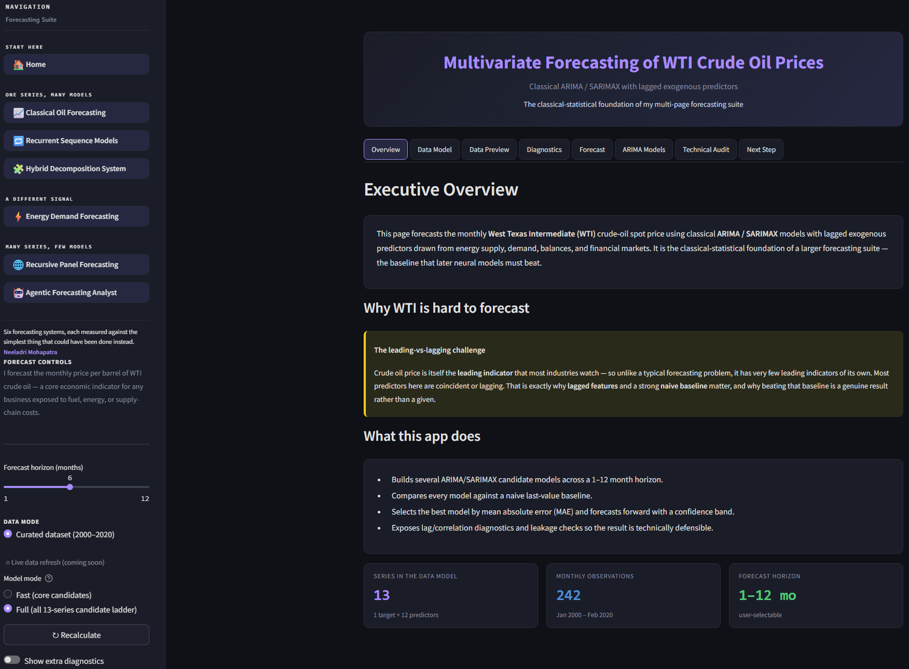
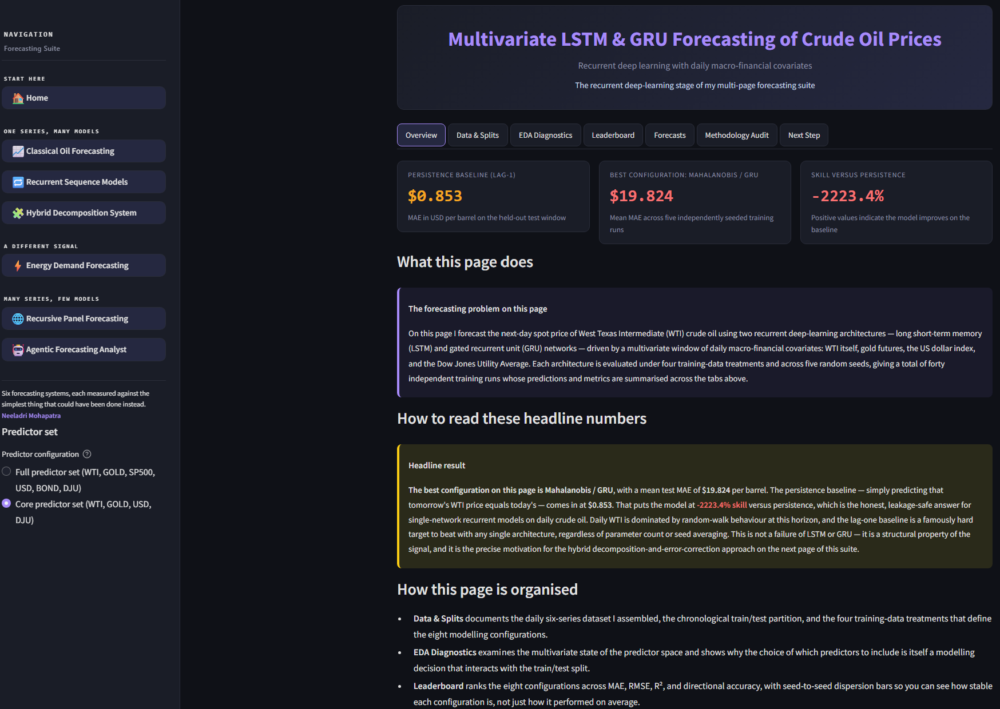
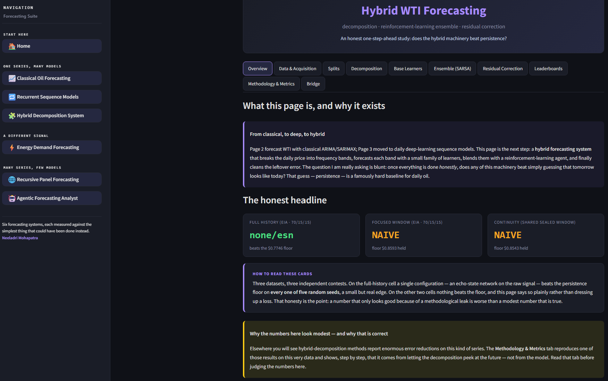
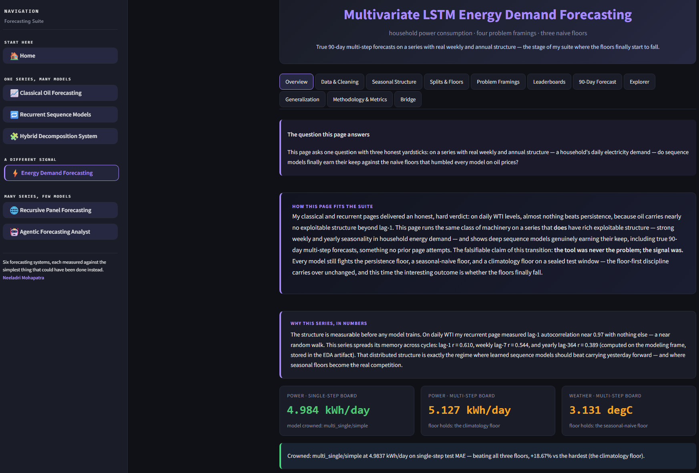
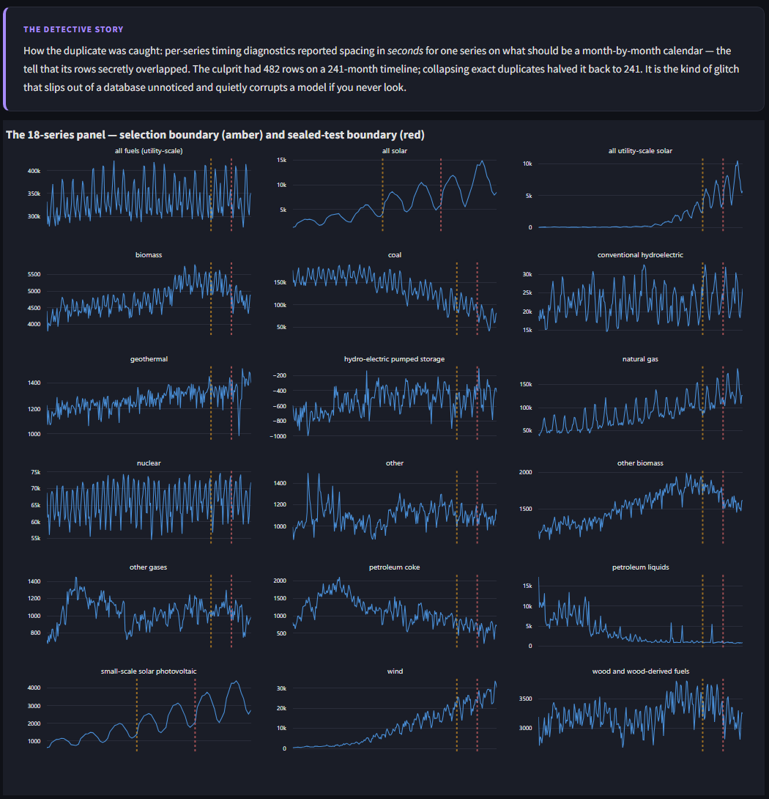
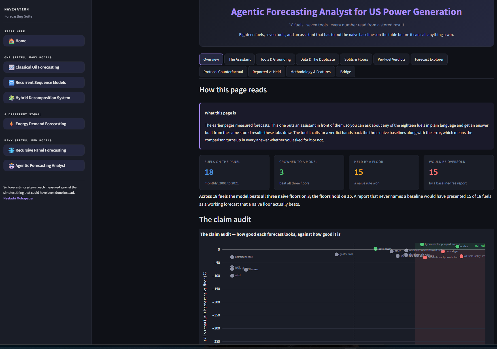

<h1 align="center">📉 Most Forecasts Lose to Doing Almost Nothing</h1>

<p align="center">
  <i>Six time-series forecasting systems, built end to end, every one of them measured against the simplest thing that could have been done instead.</i>
</p>

<p align="center">
  
  
  
  
  
  
  
</p>

<table align="center">
  <tr>
    <td align="center">
      <a href="https://crudeforecasting-suite-saas.streamlit.app/">
        
      </a>
      <br/><b>👆 Seven pages. Open any of them.</b>
    </td>
  </tr>
</table>

---

> ### 🎯 The one sentence
>
> A forecasting model is easy to make look good. Report an error, report an R², plot the prediction against the truth, and almost anything passes. **The comparison that decides whether the model did anything at all — against carrying the last value forward, repeating last year, or taking an average — is the one most often left out.**
>
> So I built six forecasting systems and put that comparison in front of every result in all of them.

---

## 📑 Contents

- [🧭 Why this exists](#-why-this-exists)
- [🔄 System workflow](#-system-workflow)
- [🏆 The scoreboard](#-the-scoreboard)
- [🧱 The six systems](#-the-six-systems)
- [🏗️ System design](#️-system-design)
- [🔬 How every number is verified](#-how-every-number-is-verified)
- [🤖 The agentic analyst](#-the-agentic-analyst)
- [📸 Screenshots](#-screenshots)
- [🔧 Tech stack](#-tech-stack)
- [📦 Project structure](#-project-structure)
- [🛠️ Running it](#️-running-it)
- [⚠️ Honest limitations](#️-honest-limitations)

---

## 🧭 Why this exists

Every page in this suite answers the same question about a different dataset and a different model class: **did the model beat doing nothing?**

That question is easy to ask and unusually easy to avoid. A leaderboard sorted by MAE will always have a winner. An R² of 0.72 reads as respectable. A prediction line that tracks the truth looks convincing on any chart. None of those tell you whether the model earned its place, because none of them include the thing you would have done without a model at all.

So this project fixes the rule first and builds around it:

> **Nothing is called a win until it strictly beats every naive baseline its data allows.**

Six systems. Six datasets or framings. One rule, enforced in code, asserted in tests, and printed in the same sentence whether the winner turned out to be the model or the baseline.

**The build order is an argument, not a tour.** Each page exists because the one before it left a question open:

| Stage | What it settled | What it left open |
|---|---|---|
| **Pages 2–3** · one series, many models | A classical ladder and 80 sequence-model configurations both lose to the baseline on oil prices | Is it the models, or the signal? |
| **Page 4** · one series, one elaborate system | Decomposition + reinforcement ensemble barely clears the bar; a deliberate leak shows where "good results" come from | Would a better signal change the answer? |
| **Page 5** · a different signal | Same model class, structured data — an outright win | Does this scale past one series? |
| **Page 6** · many series, few models | 18 series, a handful of global models, per-series verdicts | Does the discipline survive a conversation? |
| **Page 7** · the same discipline, questioned | An assistant whose tools hand back the baselines with every number | — |

---

## 🔄 System workflow

<p align="center">
  
</p>
<p align="center"><i>End-to-end architecture: offline training → JSON artifacts → read-only dashboard, with the baseline rule enforced at every grading step.</i></p>

> 📥 **Editable version:** the workflow diagram ships as a `.drawio` file in the repo. Open it at [app.diagrams.net](https://app.diagrams.net/) to modify.

---

## 🏆 The scoreboard

Across the pages, **54 separate contests** were graded — each one a model against every naive baseline its data allows, on a window that selection never touched.

<div align="center">

| Page | System | Contests | Model won | What actually happened |
|:---:|---|:---:|:---:|---|
| **2** | Classical ARIMA/SARIMAX | 12 horizons | **short only** | Past the first few months, carrying the last price forward wins |
| **3** | LSTM / GRU sweep | 80 configs | **0** | The same baseline error sits under all 80 runs |
| **4** | Hybrid + RL ensemble | 3 cells | **1** | +0.59% on one cell; the baseline holds the other two |
| **5** | Multivariate LSTM | 3 boards | **1** | **+18.67%** against climatology — the first outright win |
| **6** | Recursive panel | 18 series | **7** | +8.61% pooled skill; baselines hold 11 of 18 |
| **7** | Agentic analyst | 18 fuels | **3** | **15 of 18 would read as working forecasts without the comparison** |

</div>

**That ratio is the result, not an embarrassment in it.** A suite where every page announced a win would tell you the baselines were chosen badly. These weren't: each page uses the hardest reference its data allows, and reports what happened.

Three findings I would not have had without the rule:

| 🔍 Finding | Measured | Where |
|---|---|---|
| **Leakage manufactures skill** | A single lookahead line fabricates **+11.4% to +15.0%** of apparent improvement | Page 4 |
| **The quoted error isn't the forecast's error** | Letting a model refill its own lags costs a median **+4.3%**, up to **+71.9%** | Page 7 |
| **Duplicated rows flatter a model** | An export shipping one series 4× reports **37.7% better** on a holdout covering 6 months while claiming 24 | Page 7 |

---

## 🧱 The six systems

### 📈 Page 2 · Classical Oil Forecasting
**ARIMA · SARIMAX · monthly WTI · 12 horizons**

Where the project starts and where its rule comes from. A ladder of classical models is fitted at every horizon from one month to twelve, each one placed next to a baseline that simply carries the last price forward.

Replacing `auto_arima` with a direct statsmodels AIC grid cut per-fit time from ~10.7s to ~1.4s. The real output isn't the speedup — it's the finding that past the short horizons, the baseline wins, and saying so out loud is what the remaining five pages are built around.

---

### 🔁 Page 3 · Recurrent Sequence Models
**LSTM · GRU · multivariate · daily WTI**

The obvious next move: if classical models can't beat carrying the last price forward, try sequence models. **80 configurations** across two architectures, lookback windows, feature sets and scaling — all scored against the same constant baseline error of **$0.8532**.

The sweep is deliberately large enough to close off the "you didn't try the right settings" objection. Scalers are fitted on training data only, so no configuration gets a quiet advantage.

---

### 🧩 Page 4 · Hybrid Decomposition System
**Frequency-band decomposition · TCN · GRU · ESN · SARSA ensemble · ELM corrector**

The most elaborate machinery in the project, built to test whether the failure is architectural rather than one of capacity. The signal is split into frequency bands, three different learners take a band each, a reinforcement-learning agent weights them, and a residual corrector cleans up after.

The result: **+0.59% over the baseline on one cell**, baselines holding the other two.

The page's real contribution is the counterfactual beside it. The same system is rebuilt **with a lookahead leak deliberately introduced**, to measure what one careless preprocessing line is worth: **+11.4% and +15.0% of fabricated skill**. That number explains a great many published results.

---

### ⚡ Page 5 · Energy Demand Forecasting
**Multivariate LSTM · household power · weather control**

A change of data rather than a change of method. Household electricity has real structure — daily cycles, weekly cycles, weather dependence — and the same class of model that failed on oil prices finally earns its keep: **4.9837 kWh/day against a climatology baseline of 6.1274, a +18.67% win.**

Two other boards on the same page are still held by baselines, so the win is specific rather than general. The payoff line of the project's first half: **the tool was never the problem, the signal was.**

---

### 🌐 Page 6 · Recursive Panel Forecasting
**18 generation series · 12 global models · 24-month recursion**

Scale sideways instead of upward. Rather than 18 bespoke pipelines, a small set of global models is fitted across the whole panel and asked to forecast two years ahead by feeding its own predictions back in.

**7 of 18 series are crowned to a model, 11 held by baselines, pooled skill +8.61%.** Every series is graded separately, so pooling can't hide a series the model handles badly — and the page quantifies what peeking at the test window would have bought (**~19.37%**), rather than merely promising it didn't.

---

### 🤖 Page 7 · Agentic Forecasting Analyst
**7 grounded tools · recorded and live modes · OpenAI or Google**

An assistant in front of the same 18 fuels, answering in plain language from the same stored results the charts are drawn from. Covered in depth [below](#-the-agentic-analyst).

---

## 🏗️ System design

The architectural decision that makes six systems of this size deployable at once:

> **Heavy compute runs offline and writes small JSON. The deployed app reads that JSON and nothing else.**
> It never fits a model, never calls a data API for its own numbers, and never writes to disk.

```
   OFFLINE (local / Colab / GPU)              DEPLOYED (1 modest container)
   ─────────────────────────────              ─────────────────────────────
   raw data  ──►  data spine                  JSON artifacts ──►  page views
                  (assert, dedupe,                  │              (read, draw,
                   split by date)                   │               explain)
                      │                             │
                  feature layer                     │            no training
                      │                             │            no fetching
                  train + grade  ──► JSON ──────────┘            no writing
                      │
                  audit layer  ──► JSON
```

**What this buys:**

| Decision | Consequence |
|---|---|
| Artifacts are small JSON | 499 stored results across six systems total **~26 MB** — six systems fit in one free-tier container |
| No training library in the deploy set | TensorFlow, PyTorch, XGBoost and LightGBM are **training-only**; the host installs none of them |
| Pages import nothing from each other | A page reaches another only by **reading its files by filename pattern** — so one can be rebuilt without touching the five beside it |
| Every page owns its schema and vocabulary | Schemas are versioned (`1c.1` → `7C.1`) and a stale file is **never silently reused** |
| Verdict text is built from the artifacts | The words cannot drift from the figures, because both come from the same file |

**Page isolation in practice.** Seven pages, seven module namespaces, one shared theme and one shared metric module. Cross-page references go through read-only bridges that `glob` + `json` and import nothing. When Page 2's winner field was found to predate its own baseline-aware fix, the later pages' bridges **re-derived it under the current rule** rather than repeating a retracted claim.

---

## 🔬 How every number is verified

Seven gates run before any page ships. The two that matter most:

### 🛡️ The false-negative shield

The training gate trusts nothing the training run printed. It reloads the artifacts and independently recomputes:

- every reported MAE, RMSE and R² **from the rawest stored prediction vectors**
- every baseline **from the raw data frame**, not from its stored summary
- every crown **from the rule**, not from the stored flag
- the panel verdict **from the rows**, not from the stored sentence

It passes against whatever artifact set is on the machine, which matters more than it sounds: **library versions differ between machines.** Two crowns moved between my container and my workstation purely because of an XGBoost major version. Every test re-derives its expectations from the files it finds, so a page is always checked against its own results.

That episode also produced a feature: any crown with a margin under 2% is now labelled **narrow**, because a win a library upgrade can erase is not a win to lean on.

### 🧪 Content-asserting boot tests

Each page is booted through Streamlit's `AppTest` and checked for what it *says*, not that it didn't crash:

- verdict sentences asserted **verbatim** against the artifact-built originals
- every baseline value confirmed on screen to one decimal
- **all interactive controls switched**, then the rebuilt caption checked for the newly selected item's own numbers — a static caption under a dropdown is treated as a defect
- widgets located by **stable key**, never by position

A third gate scans every file for vocabulary that would blur one page's metric terms into another's, or frame the work as anything other than my own.

---

## 🤖 The agentic analyst

An assistant whose honesty ceiling is set by its tool surface — so the tools were designed first.

### 🧰 Seven tools, all reading precomputed JSON

| Tool | Returns |
|---|---|
| `list_fuels` | all 18 fuels with verdict and history length |
| `get_fuel_verdict` | error, **all three baselines**, hardest one, crown, margin band, overclaim flag |
| `get_fuel_projection` | 12 unscored months plus what recursion cost that model |
| `compare_fuels` | panel ranking by skill, error, growth or recursion |
| `get_methodology` | the four counterfactuals and the split design |
| `get_figure` | names a figure for the page to draw — never returns an image |
| `get_limits` | what it cannot answer, and what it must always say |

**`get_fuel_verdict` is the one that matters.** Give an assistant tools that return metrics and nothing else and it will narrate every fuel with equal confidence, because nothing it can reach knows what a baseline is. Here the comparison arrives *with* the number instead of after it, and the system prompt makes calling it mandatory before any fuel is described.

### 🎚️ Three answer modes, each labelled on screen

| Mode | What it is | Key needed |
|---|---|---|
| **Composed** | Built straight from the stored results by a function — deterministic, always numerically correct | ❌ |
| **Recorded** | A real model run captured offline and replayed with its tool calls intact | ❌ |
| **Live** | Running now, against **your own key**, with a provider and model you pick | ✅ yours |

Recorded sessions carry a fingerprint of the results board. Rebuild the artifacts and they are flagged stale, and the page falls back to composed rather than showing words that no longer match the figures beside them.

**Live mode takes the visitor's key, not mine** — OpenAI or Google, masked input, session-only, scrubbed from every error message. Both adapters speak plain HTTP, so live mode adds **zero dependencies** to the deployed app, and the loop that records offline is the identical loop that runs live.

Every answer carries an expandable **tool trace**: which tool fired, with what arguments, and what came back.

---

## 📸 Screenshots

### 🏠 Landing page
<p align="center"></p>
<p align="center"><i>The thesis, a live scoreboard read from the pages' own results, and navigation into all six systems.</i></p>

### 📈 Classical forecasting
<p align="center"></p>
<p align="center"><i>The model ladder against the baseline at every horizon.</i></p>

### 🧩 Hybrid system and the leakage counterfactual
<p align="center"></p>
<p align="center"><i>The same system rebuilt with a deliberate lookahead leak, to price what one careless line is worth.</i></p>

### ⚡ Energy demand — the first outright win
<p align="center"></p>

### 🌐 Recursive panel across 18 series
<p align="center"></p>

### 🎯 The claim audit map
<p align="center"></p>
<p align="center"><i>Every fuel placed by how good it <b>looks</b> against how good it <b>is</b>. The lower-right quadrant is a respectable R² sitting on top of a forecast a naive rule beats.</i></p>

### 🤖 The assistant, with its tool trace
<p align="center"></p>

---

## 🔧 Tech stack

| Layer | Technology |
|---|---|
| **Dashboard** | Streamlit 1.41 · Plotly · custom dark theme |
| **Classical** | statsmodels (SARIMAX, AIC grid) · scipy |
| **Deep learning** | TensorFlow/Keras (LSTM, GRU) · PyTorch (TCN, GRU) |
| **Gradient boosting** | XGBoost · LightGBM |
| **Other learners** | Echo State Network · Extreme Learning Machine · SARSA reinforcement ensemble |
| **Data** | pandas · NumPy · PyArrow (Parquet) · pyreadr |
| **Agent** | Plain HTTP tool-calling loop · OpenAI · Google Gemini |
| **Testing** | Streamlit `AppTest` · artifact-driven re-derivation gates |
| **Deployment** | GitHub · Streamlit Community Cloud |

> Every deep-learning and boosting library above is **training-only**. The deployed app installs none of them.

---

## 📦 Project structure

```
forecasting-suite/
├── 🏠 app.py                        # Entry point — the landing page
├── 📁 pages/                        # One thin router per page
│   ├── page2_wti_classical.py
│   ├── page3_lstm_gru.py
│   ├── page4_hybrid.py
│   ├── page5_energy_lstm.py
│   ├── page6_panel_recursive.py
│   └── page7_agent.py
├── 📁 src/
│   ├── theme.py  config.py  evaluation.py   # Shared across every page
│   ├── home_views.py  home_bridge.py        # Landing page
│   ├── page2_views.py  modeling.py          # Classical
│   ├── page3_views.py  data_lstm.py         # Recurrent
│   ├── page4_views.py  hybrid_*.py          # Hybrid + RL ensemble
│   ├── page5_views.py  energy_*.py          # Energy demand
│   ├── page6_views.py  panel_*.py           # Recursive panel
│   └── page7_views.py  agent_*.py           # Agentic analyst
├── 📁 artifacts/                    # 499 JSON results — what the app reads
├── 📁 data/                         # Small committed inputs
├── 📁 tests/                        # Gates: smoke, boot, voice, deploy probe
├── 📁 docs/                         # Sprint-by-sprint build record
├── 📁 notebooks/                    # Colab training notebooks
├── 📄 requirements.txt              # Deploy runtime — no training libraries
└── 📄 requirements_page{4,5,6,7}_train.txt   # Offline training only
```

---

## 🛠️ Running it

### ☁️ Live
No installation — [**open the app**](https://crudeforecasting-suite-saas.streamlit.app/). Every page reads precomputed results, so nothing trains while you browse.

### 💻 Local

```bash
git clone <repo-url>
cd forecasting-suite

conda create -n forecasting-suite python=3.10
conda activate forecasting-suite
pip install -r requirements.txt

streamlit run app.py
```

### 🔁 Rebuilding the results

Each page's artifacts regenerate from its own pipeline, offline:

```bash
pip install -r requirements_page7_train.txt

python -m src.agent_data          # data spine, with assertions
python -m src.agent_train --run   # fit, grade, apply the crown rule
python -m src.agent_train --validate
python -m src.agent_audit         # the four counterfactuals
python tests/test_7c_smoke.py     # re-derive every number independently
```

---

## ⚠️ Honest limitations

A section this project would be inconsistent without.

- **The wins are few, and that is the finding.** Three of the six systems never beat their baselines on their primary board. Presented differently, all six would have looked successful.
- **Two crowns sit inside library noise.** A major XGBoost version bump moved them. Margins under 2% are labelled **narrow** rather than presented as settled.
- **The forward projections are never scored.** No actuals exist for them. They are labelled unscored everywhere they appear, and the recursion penalty is quoted alongside.
- **Nothing here models cause.** These systems say what generation or price did, never why. The assistant refuses causal questions by design.
- **The data ends January 2021.** The panel and agent pages cannot speak to anything after that, and say so when asked.
- **One page's live data mode is disabled.** The classical page ships with its curated dataset; the live-refresh path exists but is switched off.

---

<p align="center">
  <b>Built by Neeladri Mohapatra</b><br/>
  <i>Six forecasting systems · one rule · 499 stored results · every number re-derived by a test</i>
</p>

<p align="center"><a href="#-most-forecasts-lose-to-doing-almost-nothing">⬆️ Back to top</a></p>
